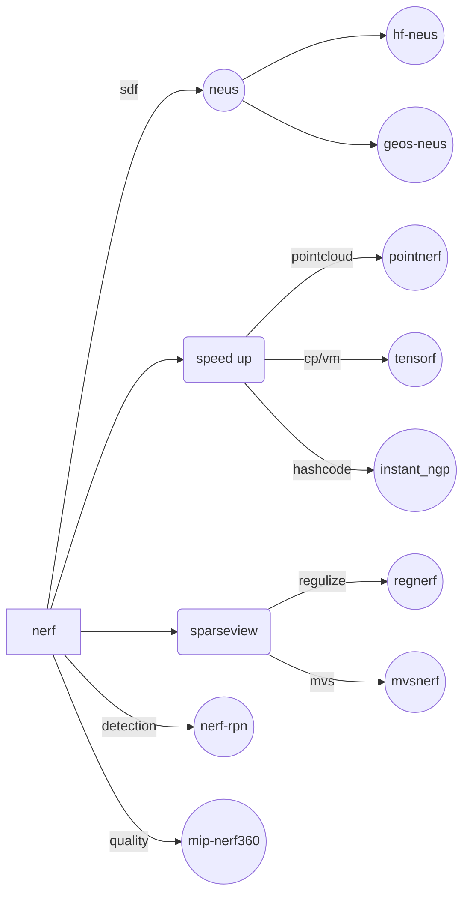

```mermaid
graph LR;
nerf--sdf-->emperor((neus))
emperor-->emperor6((hf-neus))
emperor-->emperor7((geos-neus))
nerf-->emperor2(speed up)
emperor2--pointcloud-->emperor3((pointnerf))
emperor2--cp/vm-->emperor4((tensorf))
emperor2--hashcode-->emperor5((instant_ngp))
nerf-->emperor12(sparseview)
emperor12--regulize-->emperor11((regnerf))
emperor12--mvs-->emperor8((mvsnerf))
nerf--detection-->emperor9((nerf-rpn))
nerf--quality-->emperor10((mip-nerf360))

```

